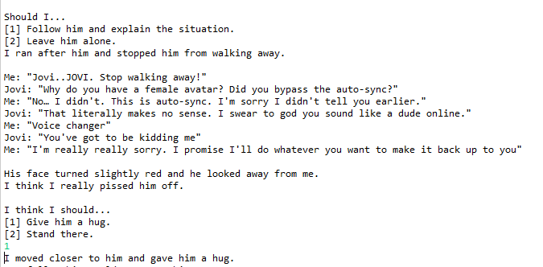
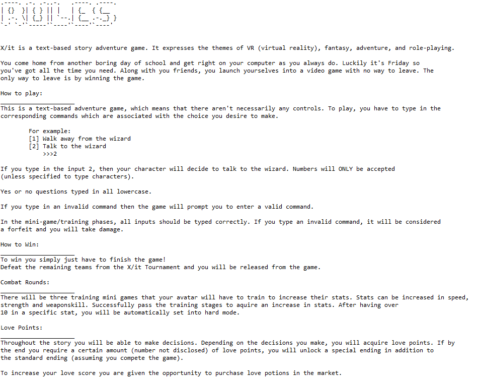

# Xit
An original text-based Adventure Game created with **Java**. 

Xit (pronounced exit) is about a group of friends who decide to try out a new video game but suddenly get sucked into another dimension where they are in the game itself! THe group of friends must become stronger and make the right decisions to escape and get back home. There are many twists, turns and opportunities for you to become stronger and arrive at the happy ending!

Make sure the path to the cutscenes file matches to the path in your computer for the cutscenes file in the Xit main file. Enjoy!

## How to Play
### Make Choices
Choose how you want to interact with other characters. Your decisions do influence the output of the game so choose carefully! You will be prompted to enter a number for a specific choice selection or you will be prompted to enter custom words. Read the options carefully before choosing.

  

### Play Mini Games
There are tons of mini-games throughout your adventure. Follow the rules carefully and do as you are told. If luck is on your side you might be the winner!

### Detailed Instructions
Below are the official instructions from the game.

  

## Notable Features

### Customization
Customize your avatar. Choose you avatar name, costume, and how you look!

  

### Player Stats
You progress, health, strength, speed, and love level will all be located inyour player stats section. This updates frequently during the game so don't worry if you aren't sure where you are at.
